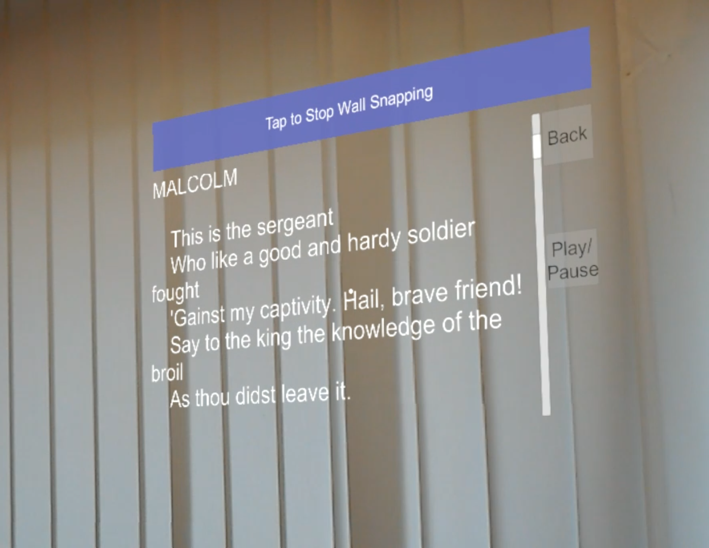

# AReader

## Project Description

This repository contains two prototypes which demonstrate different ways how to realize AR reading on the HoloLens.
It offers multiple use cases, e.g. for actors who can learn their lines while simultaneously performing.
As an autocue it is also suitable for delivering speeches and presentations.

## Getting Started

### Required Software

| Windows 10 | [Unity 2017.4](https://unity3d.com/unity/qa/lts-releases) | Visual Studio 2017 | [MixedRealityToolkit 2017.3](https://github.com/Microsoft/MixedRealityToolkit-Unity/releases/tag/2017.4.3.0-Refresh) |
| :--- | :--- | :--- | :--- |
| Development and deployment of apps for Windows Mixed Reality should happen on the Windows 10 operating system. | Unity is a graphics engine for creating 2D and 3D interactive graphics applications. The long-term support version (LTS) of Unity can be used. The current LTS version is [2017.4](https://unity3d.com/unity/qa/lts-releases). | Visual Studio can be used to edit the code. It provides debugging tools for Unity. | The MixedRealityToolkit is an auxiliary resource which provides building blocks and an architecture for accessing the Mixed Reality hardware. |

### Required Hardware

It is recommended to deploy the application to the Microsoft HoloLens.
However, it can also be tested in Unity and in the Holographic Emulator.

### Build

First, a Visual Studio solution has to be generated from the Unity project.
After that, the app can be deployed by using Visual Studio.

A detailed instruction can be found [here](https://docs.microsoft.com/de-de/windows/mixed-reality/exporting-and-building-a-unity-visual-studio-solution).